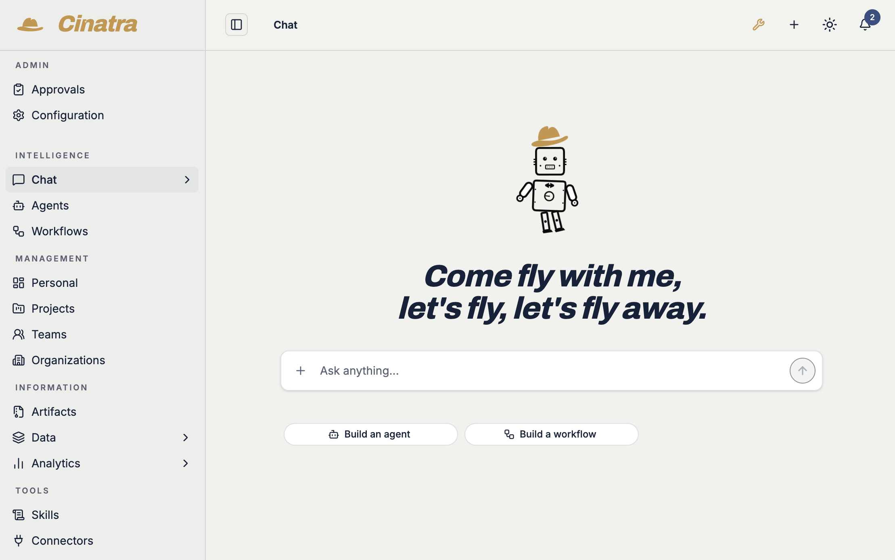

<div align="center">


# CINATRA

**The open source AI workspace for teams**

[](LICENSE)
[](https://docs.cinatra.ai)
[](https://github.com/cinatra-ai/cinatra/actions/workflows/build-image.yml)
[](https://docs.cinatra.ai)



</div>

> [!WARNING]
> **Cinatra is not production ready!**
> It is under active development and has not been hardened, security-audited, or stability-tested for production workloads. Run it for evaluation, local development, and self-hosted experimentation only. Do not deploy it to handle production data, untrusted users, or business-critical workflows yet. APIs, schemas, and the extension contract may change without notice.

---

## What Cinatra is

Cinatra is an open source AI workspace for teams: a shared, persistent, browser-based environment where people, AI assistants, and autonomous agents work together. It turns isolated prompts into durable workflows that have state, tooling, handoffs, approvals, and real operational outputs.

Most AI tools are optimized for individual use and short chat sessions. Cinatra is built for collaborative work that takes time, spans systems, requires oversight, and improves as teams capture their patterns into reusable skills, extensions, artifacts and agents.

### Core pillars

- **[A connected ecosystem of capabilities](https://docs.cinatra.ai/guides/user/connected-ecosystem/).** Agents, connectors, skills, objects, lists, and dashboards live in one capability fabric. Workflows compose across domains instead of living as isolated scripts.
- **[Human-in-the-loop by design](https://docs.cinatra.ai/guides/user/human-in-the-loop/).** Agents pause at typed HITL gates for review, edits, approvals, or missing context — instead of forcing an all-or-nothing automation model.
- **[Continuous learning](https://docs.cinatra.ai/guides/user/continuous-learning/).** Prompt edits inside HITL surfaces are captured into per-user, per-agent personal skills that prime the next run. Improvements become reusable operating knowledge instead of getting lost in chat history.
- **[An extendable marketplace](https://docs.cinatra.ai/guides/user/marketplace-and-extensions/).** Install agents, connectors, skills, artifacts, and workflows from the marketplace onto a running workspace, with the access each team grants — and publish your own.
- **[Cross-instance collaboration](https://docs.cinatra.ai/guides/user/cross-instance-collaboration/).** Cinatra instances share a marketplace, install each other's extensions, and call each other's agents over A2A — with run data staying where the run runs.
- **[Durable workflows](https://docs.cinatra.ai/guides/user/durable-workflows/).** Background execution with BullMQ over Redis and durable state in PostgreSQL. Workflows survive page reloads, resume from network drops, and pause for human approval without losing context.

## Example: Email outreach campaign

1. A user tells the AI assistant they need to run an outreach campaign.
2. Cinatra spins up an Email Outreach agent (or reuses an existing one) with a default `SKILL.md` describing the ideal customer profile and contact-selection rules.
3. The agent selects prospects, enriches their data, and drafts personalized emails using company context and recent events.
4. The team reviews the drafts, edits them one by one, or applies prompt-driven changes across the whole batch.
5. Replies are tracked and follow-ups are sent automatically using the same workflow.
6. Prompts and edits made along the way can be captured back into a custom `SKILL.md`, so the next campaign starts tuned to the team's real working style.

## Inside the app

The main sidebar groups the day-to-day workspace:

- **Chat** — multi-threaded AI assistant chat with team threads; the place agents are created, run, and edited conversationally
- **Agents** — installed agents and run history. The top-level `/agents` route is an interactive dashboard of recently used and recently run agents, and is the installed-agents surface
- **Management** — Personal, Projects, Teams, Organizations
- **Information** — Artifacts, Data (a unified object list with typed views, plus History and Merge), and Analytics (LLM and API usage)
- **Tools** — Skills (catalog, installed packages, match overview, autosave from chat edits) and Connectors (e.g. Gmail, Google Calendar, Apollo, LinkedIn, WordPress, Drupal, Apify, YouTube, GitHub)

Beyond the sidebar, the platform ships routes for **Dashboards** (custom drag-and-drop dashboards on a shared semantic layer, with the agents dashboard as the default at `/agents`), **Lists** (typed groupings agents read from and write to as first-class inputs and outputs), and **Notifications** (a durable feed with real-time updates and failure routing). They are reachable directly by URL and as MCP primitives.

A separate **Administration** area covers platform-level settings: LLM providers, MCP, assistants, [marketplace](https://docs.cinatra.ai/guides/admin/marketplace/) (install agents, connectors, skills, artifacts, and workflows from the shared registry), extensions (install / archive / restore / remove), [permissions](https://docs.cinatra.ai/guides/admin/permissions/) (a co-owner model across extension resources — agents, agent runs, connectors, skills, skill packages, artifacts, and workflows), network, environment, telemetry, instance, workspace, and operations. Most administration screens are admin-only. The [Admin Guide](https://docs.cinatra.ai/guides/admin/) covers this surface in detail.

---

## Architecture

Cinatra is a monorepo of TypeScript packages running on Next.js. Each package owns its persistence, background jobs, React screens, and capability surface. Packages communicate through public capability surfaces rather than importing each other's internals.

Cinatra speaks four open agent protocols so that agents authored here are not locked here, and so that agents from other platforms plug in without bespoke integration:

- **OAS (Open Agent Specification / agentspec)** — every agent is a declarative OAS Flow file
- **A2A (Agent-to-Agent)** — every agent is callable from any A2A client; Cinatra calls remote A2A agents as local tools
- **AG-UI (Agent-User Interaction Protocol)** — typed lifecycle events streamed over SSE with durable replay
- **A2UI (Agent-to-User Interface)** — declarative HITL surface payloads on a parallel channel

Every capability is also an MCP primitive, and the whole workspace is itself reachable as an OAuth-secured MCP server — so external MCP clients (Claude Desktop, ChatGPT, OpenAI Codex, Claude.ai) can drive Cinatra directly.

The agent runtime is **WayFlow**, the reference OAS implementation, running as a Python sidecar. The Next.js app invokes it over A2A — making the runtime replaceable by any OAS-compliant alternative.

For the full write-up, see the [Architecture](https://docs.cinatra.ai/references/platform/architecture/), [Open standards in Cinatra](https://docs.cinatra.ai/references/platform/open-standards/), and [MCP reference](https://docs.cinatra.ai/references/mcp/) pages.

---

## Quick start

```bash
git clone https://github.com/cinatra-ai/cinatra.git
cd cinatra
make setup
make dev
```

`make setup` runs an interactive script (`scripts/setup.sh`) that checks prerequisites, starts the supporting Docker services (Postgres, Redis, Nango, and others), creates `.env.local`, and provisions the app — prompting for dev/prod mode and optional sample data along the way (`YES=1` accepts the defaults).

Open <http://localhost:3000>. The first user to register becomes the platform admin and lands in the in-app setup wizard for the remaining first-run configuration.

### Connect an LLM

The final wizard step, **`/setup/ai`**, gives the instance a working model provider — the minimum is an OpenAI API key plus a default model, which is all agents and chat need to run. Additional providers are managed under Administration → LLM after setup: Gemini can be connected as the second globally eligible provider (it steps in when OpenAI is unavailable and can take over image generation), while Anthropic is available for specific purposes only, never as the global default. Provider configuration lives in-app, not in `.env` (the `OPENAI_API_KEY` env var only powers Graphiti object embeddings, not the assistant).

**Keeping your checkout up to date.** After pulling new code, reconcile your dev environment —
dependencies and the dev database schema — to match it:

```bash
git pull
make refresh
```

`make refresh` is dev-only and never touches git: you manage branches, it brings dependencies and
the dev database in sync with the code on disk. It applies **additive** schema changes automatically
and then runs the versioned migration chain (`migrations/core/`, recorded in the `pgmigrations`
ledger), so transformational changes (renames/backfills) apply automatically too — hand-run
release-note migrations are retired. Restart with `make dev` afterwards.

Full walkthrough with prerequisites, services, and first-time configuration: see [Installation](https://docs.cinatra.ai/guides/hosting/installation/) and [Quickstart](https://docs.cinatra.ai/guides/hosting/quickstart/) in the Hosting Guide.

---

## Documentation

The full documentation set is published at **[docs.cinatra.ai](https://docs.cinatra.ai)**.

Release history and notable changes are tracked in **[CHANGELOG.md](CHANGELOG.md)**; each tagged release also has auto-generated notes on the [GitHub Releases](https://github.com/cinatra-ai/cinatra/releases) page.

## Contributing

Issues and pull requests are welcome — start with **[CONTRIBUTING.md](CONTRIBUTING.md)** and the **[Code of Conduct](CODE_OF_CONDUCT.md)**. To report a security vulnerability, see **[SECURITY.md](SECURITY.md)**.

## License

Cinatra is open source under the Apache License 2.0 — see **[LICENSE](LICENSE)**. The WordPress and Drupal client integrations are distributed separately under GPL-2.0-or-later.
